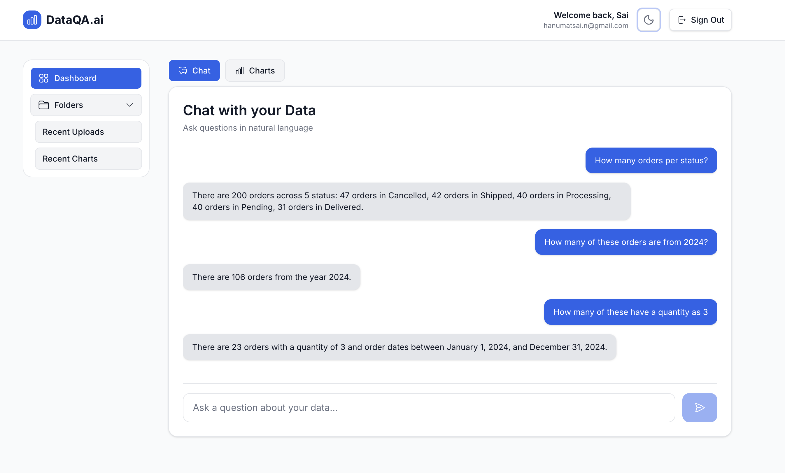
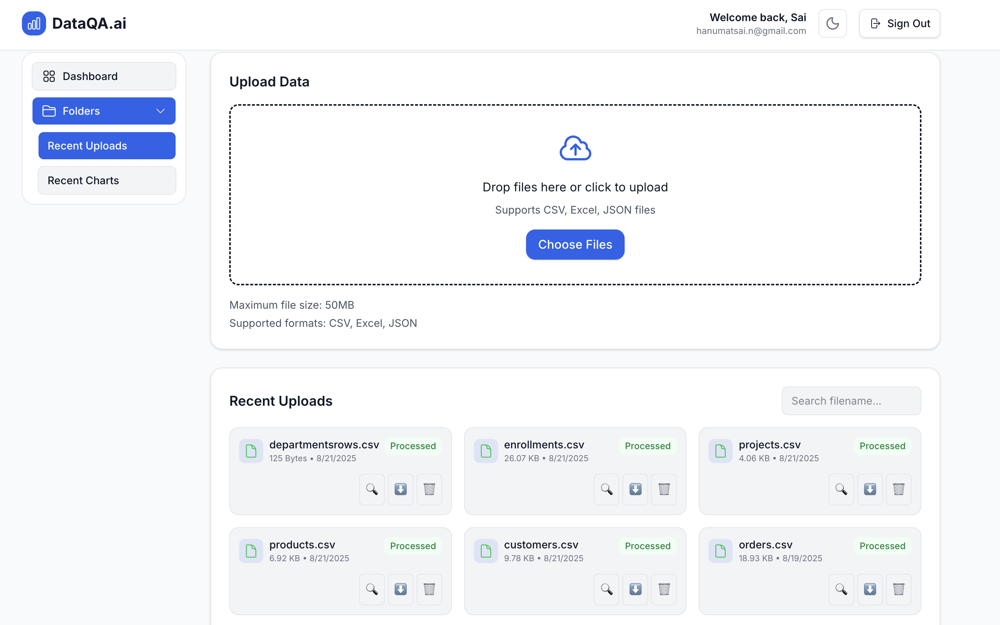
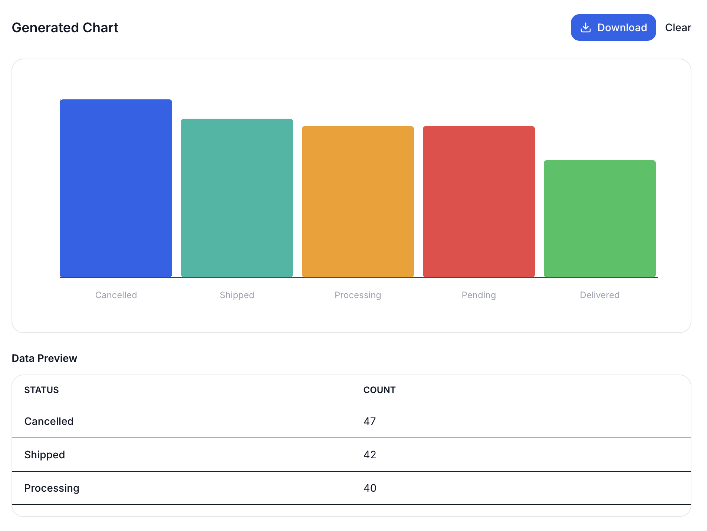
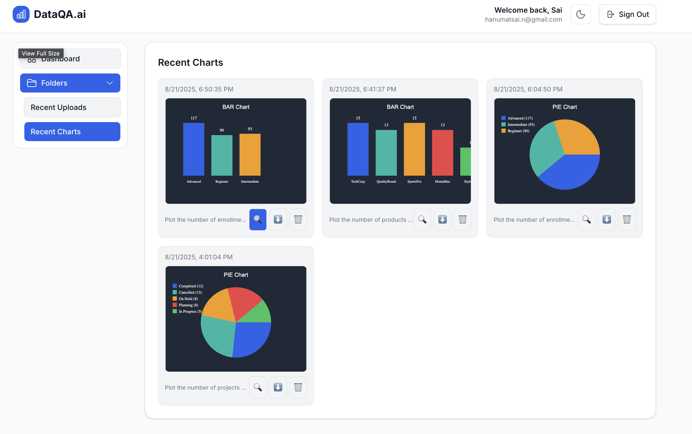

# DataQA.ai — Chat with Your Data

[](https://nextjs.org/)
[](https://www.typescriptlang.org/)
[](https://supabase.com/)
[](https://openai.com/)
[](LICENSE)

Upload a CSV, Excel, or JSON file and ask questions about it in plain English. No SQL. No scripting. Just answers.

---

## Demo

[](https://youtu.be/_zvVLOZN-PE)

---

## Screenshots

### Chat with Your Data

*Ask multi-step questions — the AI keeps context across the conversation*

---

| Upload & Manage Files | Auto-Generated Charts |
|:---:|:---:|
|  |  |
| *Upload CSV, Excel, or JSON — files are processed and embedded automatically* | *Ask for a chart and it renders one — downloadable as an image* |

### Chart History

*Every chart you generate is saved to your dashboard for later*

---

## The Problem It Solves

Most people on a team can't query a database or run Python scripts. When they get a raw CSV from someone, they either wait for a data analyst or spend an hour manually poking at it in Excel.

DataQA.ai cuts that loop short. You upload your file, ask what you want to know, and get an answer in seconds — no technical skills needed.

---

## How It Works

**1. Upload**
Drop in a CSV, Excel, or JSON file. It gets stored in Supabase and queued for processing.

**2. Parse & Embed**
The backend reads the file row by row, converts each row into a text chunk, and generates vector embeddings using OpenAI's `text-embedding-3-small`. These are stored in a Postgres vector column via pgvector.

**3. Ask**
You type a question. The system runs a vector similarity search to pull the most relevant chunks, then passes them to the LLM to generate a plain-English answer.

**4. Visualize**
If your question calls for a chart, the system picks the right chart type (bar, pie, line) and renders it client-side with Recharts. Server-side export uses Vega-Lite for clean SVGs.

**5. Revisit**
All your uploads and generated charts are saved to the dashboard. Download, preview, or reuse them anytime.

---

## Tech Stack

| Layer | Technology |
|---|---|
| Frontend | Next.js 15 (App Router), TypeScript, Tailwind CSS |
| Backend | Next.js API Routes |
| Database | Supabase (Postgres + pgvector) |
| Embeddings | OpenAI `text-embedding-3-small` |
| RAG Pipeline | Custom retrieval over vector-embedded data chunks |
| Charting | Recharts (client) + Vega-Lite (server SVG export) |
| Auth & Storage | Supabase Auth + Supabase Storage |

---

## Running Locally

```bash
git clone https://github.com/HanumatNarra/DataQA-AI.git
cd DataQA-AI
npm install
cp .env.example .env.local
# Fill in your keys (see below)
npm run dev
```

### Environment Variables

```env
NEXT_PUBLIC_SUPABASE_URL=your_supabase_url
NEXT_PUBLIC_SUPABASE_ANON_KEY=your_anon_key
SUPABASE_SERVICE_ROLE_KEY=your_service_key
OPENAI_API_KEY=your_openai_key
```

### Database Setup

1. Create a Supabase project
2. Enable the `pgvector` extension in your Supabase dashboard
3. Run the SQL files at the root — `database_schema.sql` first, then `database_functions.sql`
4. Create a storage bucket named `uploads`

---

## Project Status

This is a working prototype — not currently deployed. The core RAG pipeline, file processing, chart generation, and multi-turn chat are all functional. The screenshots above are from a locally running instance tested against real datasets (orders, HR records, product catalogs).

**What's working:**
- File upload + processing (CSV, Excel, JSON)
- Multi-turn natural language Q&A over uploaded data
- Auto chart generation (bar, pie) with download
- Chart and upload history dashboard
- User auth via Supabase

**What's next:**
- PDF support
- Background job queue for large files
- Smarter chart selection (scatter, trend lines)
- Direct database connections (Postgres, MySQL)

---

## License

MIT — see [LICENSE](LICENSE) for details.
